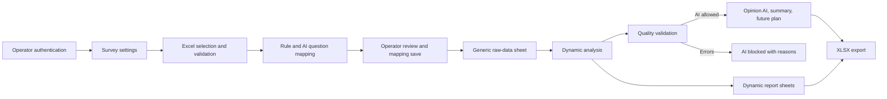
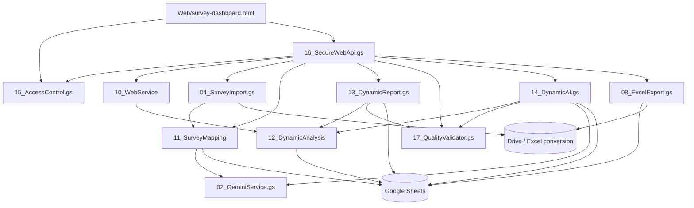
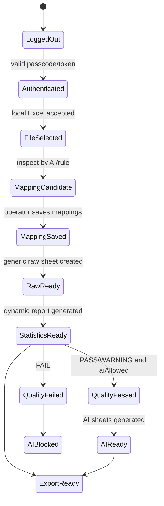
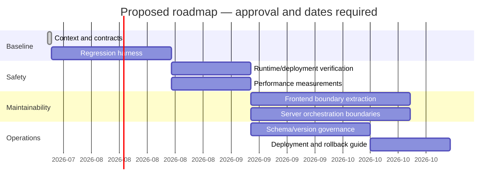
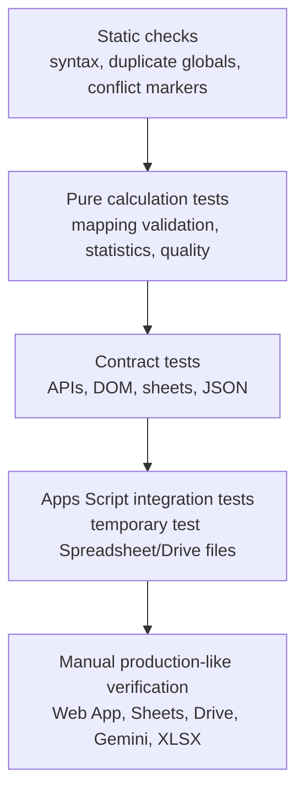

# Library Survey Automation System — Project Context

> **Document type:** Living Architecture & Delivery Baseline
>
> **Scope:** Survey analysis system only
>
> **Status:** Current-state baseline; not an implementation specification
>
> **Last reviewed:** 2026-07-22
>
> **Source of truth:** Current repository plus the completed Architecture Audit

---

## Document Control

| Field | Value |
|---|---|
| Project | 중원도서관 AI 기반 범용 설문 분석 자동화 시스템 |
| Runtime | Google Apps Script V8 / HtmlService |
| Frontend | HTML, CSS, Vanilla JavaScript |
| Server communication | `google.script.run` |
| Data/report store | Google Sheets |
| AI integration | Gemini through the existing Gemini service |
| Formal semantic version | **Unknown** |
| Working generation | Dynamic Survey v2 |
| Mapping persistence version | `2` |
| Production deployment ID | **Unknown — Needs Verification** |
| Bound Spreadsheet ID | **Unknown — Needs Verification** |
| Repository default branch | **Needs Verification** |

### How to use this document

- Treat sections marked **Protected** as compatibility contracts.
- Update this document whenever a Sprint changes a public function, DOM identifier,
  sheet, JSON response, workflow gate, or runtime dependency.
- Record unknown operational values as **Unknown** or **Needs Verification**; do not
  manufacture deployment details.
- This document does not authorize a refactor. A change still requires its own
  design, regression scope, and review.

---

# 1. Project Overview

The project automates the survey-reporting workflow for a public library. The
survey subsystem accepts Excel responses, identifies question structure, allows
an operator to confirm mappings, creates a generic raw-data sheet, calculates
dynamic statistics, validates their quality, optionally produces Gemini-based
opinion analysis, and exports a final XLSX report.

The repository also contains an AI promotion assistant. That subsystem shares
some project-level services, including Gemini configuration, but is outside this
document's functional scope and must not regress as a side effect of survey work.

## Confirmed business flow



## Primary system qualities

- Backward compatibility with legacy dynamic sheet-name fallbacks where still used.
- Rule-based recovery when Gemini mapping fails.
- Separation of missing and unmapped scale values.
- Explicit statistical denominators.
- Quality validation before AI interpretation.
- Authentication wrappers for survey-dashboard business calls.
- Preservation of the promotion subsystem.

---

# 2. Current Version

There is no confirmed semantic application version in the repository.

| Version concept | Current value | Confidence |
|---|---:|---|
| Product generation | Dynamic Survey v2 | Confirmed by code/test naming and project history |
| Mapping sheet schema | `mappingVersion = "2"` | Confirmed |
| API version | **Unknown** | No explicit API version contract found |
| Analysis schema version | **Unknown** | No explicit persisted analysis-version field found |
| Report schema version | **Unknown** | Sheet names define the effective current generation |
| Web deployment version | **Needs Verification** | Requires Apps Script deployment inspection |

The current baseline includes dynamic mapping, dynamic statistics, quality
validation, quality-gated AI reporting, secure web wrappers, and dynamic XLSX
export. The fixed-format survey implementation has been removed; only the
mapping-driven dynamic path remains supported.

---

# 3. Current Architecture

## 3.1 Logical layers



## 3.2 Architectural characteristics

- All GAS files share one global Apps Script namespace; there are no JavaScript
  imports or exports.
- `16_SecureWebApi.gs` is an authentication façade, not the business layer.
- `10_WebService` exposes dynamic survey status and dashboard services.
- `12_DynamicAnalysis` is the central calculation layer for the dynamic path.
- `17_QualityValidator.gs` is the safety boundary between calculated results and
  AI interpretation/export policy.
- The frontend is a single HtmlService document containing markup, CSS, global
  state, event handlers, server calls, and rendering logic.
- Spreadsheet sheets are both persistence and report output surfaces.

## 3.3 Legacy compatibility boundary

The fixed-format survey workflow and its menu/API entry points have been
removed. Legacy dynamic sheet-name fallbacks remain where documented, and the
promotion subsystem remains unchanged. The empty fixed-format responsibility files `05_SurveyAnalysis.gs`,
`06_SurveyOpinionAI.gs`, and `07_SurveyReport.gs` have been removed.

---

# 4. Folder Structure

```text
Library-Survey-Automation-System/
├── AppsScript/
│   ├── 00_Config.gs                # Shared and dynamic configuration
│   ├── 01_Main.gs                  # Menu/web entrypoints
│   ├── 02_GeminiService.gs         # Shared Gemini transport; promotion-sensitive
│   ├── 03_PromoService.gs          # Promotion subsystem; out of survey scope
│   ├── 04_SurveyImport.gs          # Excel import, inspection, raw data
│   ├── 08_ExcelExport.gs           # Dynamic XLSX export
│   ├── 09_Utils.gs                 # Shared helpers
│   ├── 10_WebService               # Web orchestration; extensionless GAS source
│   ├── 11_SurveyMapping            # Mapping engine/persistence; extensionless
│   ├── 12_DynamicAnalysis          # Dynamic calculations; extensionless
│   ├── 13_DynamicReport.gs         # Dynamic sheet rendering
│   ├── 14_DynamicAI.gs             # Dynamic opinion/summary AI
│   ├── 15_AccessControl.gs         # Passcode/token lifecycle
│   ├── 16_SecureWebApi.gs          # Authenticated API wrappers
│   ├── 17_QualityValidator.gs      # Statistical quality gate
│   └── 19_DynamicSurveyTests.gs    # GAS regression suite
├── Web/
│   ├── index.html                  # Promotion frontend; protected from survey work
│   ├── survey-dashboard.html       # Survey v1 single-page frontend
│   ├── survey-dashboard-v2.html    # Opt-in v2 shell (`?page=survey&ui=v2`)
│   ├── survey-dashboard-v2-css.html # v2 design system and responsive styles
│   └── survey-dashboard-v2-app.html # v2 state, events, rendering, API façade
├── images/                         # README/UI reference screenshots
├── README.md
└── ProjectContext.md               # This living baseline
```

No `appsscript.json` is present in the current repository snapshot. The deployed
manifest, OAuth scopes, Advanced Drive Service configuration, and HtmlService file
mapping therefore remain **Needs Verification**.

---

# 5. HTML Structure

`Web/survey-dashboard.html` is a single document of more than 3,000 lines.

## 5.1 Page hierarchy

```text
html
├── head
│   ├── metadata
│   ├── Chart.js CDN script
│   └── one embedded style block
└── body
    ├── authentication gate
    ├── loading overlay
    └── protected application main
        ├── top navigation
        ├── hero and metrics
        ├── seven-step workflow strip
        ├── global status message
        ├── survey settings panel
        ├── Excel/mapping panel
        ├── report/quality/AI panel
        ├── KPI summary and satisfaction chart
        ├── export panel
        ├── system-status panel
        └── footer
```

## 5.2 Embedded JavaScript responsibilities

- authentication bootstrap and session restoration;
- form population and serialization;
- browser file validation and Base64 reading;
- mapping table rendering and mapping serialization;
- workflow button gating;
- `google.script.run` calls;
- loading, success, warning, and failure presentation;
- Chart.js lifecycle;
- Base64 XLSX download.

## 5.3 Event model

- Most user events use inline `onclick`, `onchange`, and `onkeydown` attributes.
- Inline handlers require their target functions to remain globally accessible.
- A window load listener initializes the protected application.
- Mapping rows are generated dynamically and later read through class selectors.

## 5.4 CSS model

- One embedded `<style>` block.
- Some element-level inline styles.
- Project-specific component classes and Bulma-like utility classes coexist.
- JavaScript assigns state classes such as `is-active`, `is-complete`,
  `is-warning`, and `is-error`.

---

# 6. GAS Structure

## 6.1 Responsibility matrix

| Module | Public entrypoints | Internal responsibility | Gemini | Sheet writes |
|---|---|---|---:|---:|
| Import | menu and web upload/inspect functions | Decode, validate, convert, select source sheet | Indirect | Yes |
| Mapping | type list, save/load/delete, test | Rule engine, profiles, AI validation/merge | Yes | Yes |
| Analysis | test entrypoints | Statistical calculation and summaries | No | No by design |
| Quality | web quality getter | Cross-check analysis/source and gate AI | No | No |
| Report | web/menu report generation | Sheet rendering, styles, charts, ordering | No | Yes |
| Dynamic AI | web/menu/test generation | Opinion categorization, context, AI sheets | Yes | Yes |
| Access | login, token validation, logout | Cache-backed authorization | No | No |
| Secure API | `secure*` wrappers | Token enforcement and delegation | Indirect | Indirect |
| WebService | status, legacy orchestration, dashboard | UI-facing aggregation and compatibility | Indirect | Mixed |
| Export | legacy/dynamic export | Temporary workbook, XLSX response | No | Temporary |

## 6.2 Function naming convention

- Names ending in `_` are intended as internal functions.
- Public/menu/web functions do not end in `_`.
- This is a convention only; Apps Script exposes functions in one shared global
  namespace and does not enforce privacy.

## 6.3 Shared dependencies

The survey modules rely on globally available helpers including `cleanText_`,
`round_`, sheet lookup/creation helpers, setting readers, Gemini callers, and the
access-token guard. Moving a function between files does not create module
isolation and must not introduce Node.js or browser module syntax.

---

# 7. Current Workflow

| Stage | Entry condition | Server path | Completion condition | Blocking condition |
|---|---|---|---|---|
| Authenticate | Page opened | AccessControl | Valid cached token | Missing/incorrect passcode |
| Settings | Authenticated | Secure API → WebService/settings | Settings saved | Required input/server error |
| Select Excel | Authenticated | Browser only initially | Valid `.xlsx`/`.xls` Base64 held in memory | Type or 12 MB limit |
| Inspect mapping | Excel selected | Import → Mapping → Gemini/Rule | Mapping candidates returned | Invalid workbook/no usable sheet |
| Review mapping | Candidates rendered | Browser state | Operator-editable values available | No mapping result |
| Save mapping | Mapping values valid | Mapping persistence | `12_문항매핑` written | Duplicate/invalid/no analysis target |
| Create raw data | Excel and mapping ready | Import | `11_범용원자료` written | File/header/size/conversion error |
| Statistics | Settings, mapping, raw data ready | DynamicReport → Analysis → Quality | Statistical sheets generated | Source/analysis error |
| Quality | Analysis source available | QualityValidator | PASS/WARNING/FAIL returned | Source cannot be built |
| AI | Statistics complete and `aiAllowed` | DynamicAI | Opinion, summary, plan sheets | Quality ERROR or Gemini failure |
| Export | Required reports available | ExcelExport | Non-empty XLSX response | Quality policy/export failure |

---

# 8. Current Pages

| Page/surface | File | Purpose | Survey scope |
|---|---|---|---|
| Survey dashboard | `Web/survey-dashboard.html` | Full survey workflow | Primary |
| Survey dashboard v2 | `Web/survey-dashboard-v2.html` | Opt-in Sprint 1 shell; Dashboard and Upload only | Experimental/additive |
| Promotion assistant | `Web/index.html` | Promotion automation | Excluded/protected |
| Google Sheets menu/UI | `01_Main.gs` and public functions | Manual operations/tests | Secondary |
| Generated Spreadsheet sheets | Active Spreadsheet | Persistence and report output | Primary |

Each survey dashboard is a single page with authentication and conditional
sections; routing selects v1 or the opt-in v2 shell rather than providing
client-side routes.

The default routing contract remains unchanged: the promotion page is the default
and `?page=survey` opens v1. The additive opt-in route
`?page=survey&ui=v2` opens the v2 shell. Mapping, Analysis, Quality, AI Report,
and Download are honest placeholders in Sprint 1.

---

# 9. Current Components

These are logical components, not separately packaged frontend modules.

| Component | Primary DOM/classes | Responsibilities |
|---|---|---|
| Access gate | `accessGate`, `accessPasscode`, `accessLoginButton` | Login and error display |
| Loading overlay | `loadingOverlay`, `loadingText` | Blocks UI during long operations |
| Top bar | `.topbar`, `.brand` | Branding, promotion link, logout |
| Hero | `.hero-box`, `.hero-metrics` | Product explanation and summary |
| Workflow strip | `.workflow`, `.workflow-item` | Seven-step visual sequence |
| Global status | `statusBox` | User-visible operation outcome |
| Settings form | settings field IDs | Read/write survey metadata |
| Upload zone | `uploadZone`, `excelFile`, `fileStatus` | File selection and status |
| Mapping editor | `mappingSection`, `mappingTableBody` | Dynamic mapping review/edit |
| Report controls | `statisticsButton`, `aiReportButton` | Statistics and AI commands |
| Quality card | `qualityState`, `qualityMessages` | Validation result and AI gate |
| KPI summary | `summary*` | Dashboard indicators |
| Satisfaction chart | `satisfactionChart` | Chart.js visualization |
| Export panel | `exportFileName`, `exportButton`, `downloadArea` | XLSX generation/download |
| System status | `systemStatusList` | Server-derived readiness state |

---

# 10. Current State Management

There is no formal state store. State is distributed across JavaScript globals,
`sessionStorage`, DOM properties, and server-side Sheets/Cache.

## 10.1 Client state

| State | Storage | Lifetime |
|---|---|---|
| Selected Excel payload | `selectedExcelData` | Current page |
| Current mapping result | `currentSurveyMappingResult` | Current page |
| Chart instance | `satisfactionChart` | Current page |
| Access token | `sessionStorage[WEB_ACCESS_TOKEN_KEY]` | Browser tab/session |
| Workflow readiness | button `.disabled` values | Current DOM |
| Quality presentation | `qualityState`, `qualityMessages` | Current DOM |
| Mapping edits | dynamically created controls | Current DOM |
| Loading status | overlay visibility/text | Current DOM |

## 10.2 Server state

| State | Storage |
|---|---|
| Authentication token | `CacheService` |
| Survey settings | `00_설정` |
| Mapping schema | `12_문항매핑`, legacy fallback `10_문항매핑` |
| Raw response data | `11_범용원자료`, legacy fallback `09_범용원자료` |
| Reports | Named result sheets |
| Durable analysis snapshot | **Unknown / not confirmed** |

## 10.3 State flow



---

# 11. Protected APIs

These function names and argument orders are compatibility contracts for the
current survey dashboard.

## 11.1 Authentication APIs

| Function | Input | Confirmed output fields |
|---|---|---|
| `verifyWebAppPasscodeFromWeb(passcode)` | string | `success`, `authenticated`, `token`, `expiresInSeconds`, `message` or `error` |
| `validateWebAppTokenFromWeb(token)` | string | `success`, `authenticated` |
| `logoutWebAppFromWeb(token)` | string | `success`, `message` |

## 11.2 Secure business APIs

- `secureGetSurveySettingsForWeb(accessToken)`
- `secureGetDynamicSurveySystemStatusFromWeb(accessToken)`
- `secureSaveSurveySettingsFromWeb(payload, accessToken)`
- `secureInspectSurveyExcelForMappingFromWeb(fileData, accessToken)`
- `secureInspectSurveyExcelByRuleFromWeb(fileData, accessToken)`
- `secureSaveSurveyMappingsFromWeb(payload, accessToken)`
- `secureGetSavedSurveyMappingsFromWeb(accessToken)`
- `secureDeleteSavedSurveyMappingsFromWeb(accessToken)`
- `secureCreateGenericRawSheetFromWeb(fileData, accessToken)`
- `secureGenerateDynamicStatisticalReportFromWeb(accessToken)`
- `secureGetDynamicSurveyDashboardDataFromWeb(accessToken)`
- `secureGetDynamicSurveyQualityFromWeb(accessToken)`
- `secureGenerateDynamicAIReportFromWeb(accessToken)`
- `secureExportDynamicSurveyReportFromWeb(requestedFileName, accessToken, options)`

## 11.3 API compatibility rules

- Do not rename these functions without retaining global wrappers.
- Do not reorder their arguments.
- Remove a secure wrapper only after every client reference has been removed and
  the underlying workflow is no longer supported.
- Preserve current top-level fields used by the frontend even if a new `data`
  envelope is introduced.
- `error` is not yet uniform across all APIs; normalization requires a dedicated
  compatibility plan.

---

# 12. Protected DOM IDs

The following 43 IDs are protected because JavaScript or user workflow depends on
them. Duplicate IDs and missing static `getElementById` targets were not found in
the Architecture Audit.

| Area | Protected IDs |
|---|---|
| Authentication | `accessGate`, `accessPasscode`, `accessLoginButton`, `accessError` |
| App shell | `loadingOverlay`, `loadingText`, `applicationShell`, `statusBox` |
| Settings | `surveyName`, `reportTitle`, `dashboardTitle`, `surveyPurpose`, `surveyPeriod`, `surveyTarget`, `surveyMethod`, `analysisMethod`, `department`, `contact`, `organization` |
| Upload | `uploadZone`, `fileStatus`, `excelFile` |
| Mapping | `mappingSection`, `mappingSummary`, `mappingTableBody` |
| Statistics/quality/AI | `statisticsButton`, `statisticsState`, `qualityState`, `qualityMessages`, `aiReportButton`, `aiReportState` |
| Dashboard | `summaryTotal`, `summaryAverage`, `summaryPositive`, `summaryRecommend`, `satisfactionChart` |
| Export | `exportFileName`, `exportButton`, `exportState`, `downloadArea`, `downloadFileName`, `downloadLink` |
| System | `systemStatusList` |

### Protected selector classes

- `.mapping-type-select`
- `.mapping-scale-kind`
- `.mapping-score-map`

The mapping serializer assumes these three NodeLists have matching row order.

### Opt-in v2 DOM namespace

All new v2 IDs use the `v2` prefix and are isolated from the v1 protected IDs.
The v2 JavaScript exposes only one namespace, `window.SurveyDashboardV2`, and
stores only `currentPage` and `uploadStatus` in session storage. File payloads and
response data are not persisted in browser storage.

---

# 13. Protected Sheet Structure

## 13.1 Current dynamic sheet order

| Order | Sheet | Purpose | Required/conditional |
|---:|---|---|---|
| 1 | `00_설정` | Survey configuration | Required |
| 2 | `01_조사개요` | Survey overview | Generated |
| 3 | `02_대시보드` | KPIs and table-based visual summaries | Generated |
| 4 | `03_응답자특성` | Respondent distributions | Generated |
| 5 | `04_단일응답분석` | Single-response analysis | Generated |
| 6 | `05_복수응답분석` | Multiple-response analysis | Generated |
| 7 | `06_척도분석` | Scale analysis | Generated |
| 8 | `07_추천의향분석` | NPS/5-point recommendation | Generated |
| 9 | `08_주관식분석` | Opinion raw/AI categories | Generated; updated by AI |
| 10 | `09_AI총평` | AI summary or AI-block reason | Conditional |
| 11 | `10_향후계획` | AI future plan | Conditional |
| 12 | `11_범용원자료` | Current generic raw responses | Required for dynamic analysis |
| 13 | `12_문항매핑` | Current mapping persistence | Required for dynamic analysis |

Quality validation remains an internal in-memory gate and is not generated or
exported as a user-facing report sheet.

Generated report tables use a separate `시각화` column containing SPARKLINE bar
formulas. Each question uses its own response-count MAX range, tied maxima remain
highlighted with `#FFF2CC`, and report generation does not create EmbeddedChart
objects. The final XLSX includes report/AI sheets through `11_범용원자료`; the
operational `12_문항매핑` sheet remains in the source spreadsheet but is not part
of the user-facing report export.

## 13.2 Legacy compatibility sheets

- `09_원자료`: fixed-format legacy survey raw data.
- `09_범용원자료`: legacy dynamic raw-data fallback.
- `10_문항매핑`: legacy dynamic mapping fallback.
- Legacy report names such as `04_복수응답분석`, `05_만족도분석`,
  `06_주관식분석`, `07_AI총평`, and `08_향후계획` still occur in legacy code.

## 13.3 Mapping sheet columns, version 2

1. 순번
2. 원본 컬럼번호
3. 원본 문항
4. 예시 응답
5. 자동 추천 유형
6. 최종 선택 유형
7. 파일명
8. 원본 시트명
9. 저장일시
10. 정규화 문항
11. 분석대상
12. 그룹 ID
13. 행렬 ID
14. 척도 유형
15. 점수 매핑 JSON
16. 신뢰도
17. 판단 이유
18. 매핑 출처
19. 매핑 버전
20. 검토 상태

The column names and semantics are protected. Readers currently support header
lookup plus legacy positional fallback.

---

# 14. Protected JSON Schemas

These schemas describe confirmed fields used across current code. Optionality is
shown where responses vary by operation.

## 14.1 Excel file payload

```json
{
  "fileName": "responses.xlsx",
  "mimeType": "application/vnd.openxmlformats-officedocument.spreadsheetml.sheet",
  "base64Data": "..."
}
```

Exact MIME field requirements across every caller are **Needs Verification**;
`fileName` and Base64 content are confirmed.

## 14.2 AI mapping request/result contract

```json
{
  "surveyStructure": {
    "title": "",
    "description": "",
    "respondentColumnNumber": null,
    "confidence": 0,
    "reason": ""
  },
  "mappings": [
    {
      "columnNumber": 1,
      "questionType": "RESPONDENT",
      "analysisTarget": true,
      "groupId": "",
      "matrixId": "",
      "scaleKind": "",
      "scoreMap": {},
      "confidence": 0,
      "reason": ""
    }
  ]
}
```

Allowed question types:

- `RESPONDENT`
- `SINGLE`
- `MULTIPLE`
- `SCALE`
- `RECOMMENDATION`
- `TEXT`
- `PERSONAL_INFO`
- `EXCLUDE`

## 14.3 Mapping result returned to the frontend

```json
{
  "success": true,
  "message": "...",
  "fileName": "...",
  "sheetName": "...",
  "questionCount": 0,
  "surveyStructure": {},
  "mappingSource": "AI | MIXED | RULE | SAVED",
  "fallbackUsed": false,
  "fallbackReason": "",
  "aiWarnings": [],
  "mappings": [
    {
      "columnNumber": 1,
      "originalHeader": "",
      "normalizedHeader": "",
      "sampleValue": "",
      "suggestedType": "",
      "selectedType": "",
      "analysisTarget": true,
      "groupId": "",
      "matrixId": "",
      "scaleKind": "",
      "scoreMap": {},
      "confidence": 0,
      "reason": "",
      "mappingSource": "",
      "reviewStatus": ""
    }
  ]
}
```

Not every source populates every optional metadata field. Consumers must preserve
the current fallback behavior, particularly `selectedType` before
`suggestedType`.

## 14.4 Mapping save payload

```json
{
  "fileName": "",
  "sheetName": "",
  "mappingSource": "",
  "mappings": []
}
```

## 14.5 Dynamic analysis root

```json
{
  "respondentCount": 0,
  "questionCount": 0,
  "respondent": [],
  "single": [],
  "multiple": [],
  "scale": [],
  "recommendation": [],
  "text": [],
  "scaleSummary": {},
  "groups": [],
  "matrix": [],
  "summary": {}
}
```

This object is internal but protected because Report, Dashboard, QualityValidator,
AI, and tests consume it.

## 14.6 Quality result

```json
{
  "status": "PASS | WARNING | FAIL",
  "errors": [],
  "warnings": [],
  "infos": [],
  "questionStats": [],
  "aiAllowed": true,
  "checkedAt": "ISO-8601"
}
```

Quality message:

```json
{
  "level": "ERROR | WARNING | INFO",
  "code": "SCALE_UNMAPPED_VALUE",
  "message": "",
  "questionId": "Q7",
  "details": {}
}
```

The web quality endpoint currently returns the same quality object in both
`data` and `quality` for compatibility.

## 14.7 Common web result pattern

```json
{
  "success": true,
  "message": "",
  "error": null,
  "data": null
}
```

This is a target pattern, not yet a universal current guarantee. Some APIs return
business fields at the top level and some return `error` as a string. Existing
top-level fields are protected until all callers are migrated and tested.

---

# 15. Global Variables

## 15.1 Frontend globals

| Variable | Purpose | Protection note |
|---|---|---|
| `MAX_EXCEL_SIZE_BYTES` | Browser upload limit, currently 12 MB | Must match server limit and UI copy |
| `selectedExcelData` | Current Base64 file payload | Required by inspect/raw creation |
| `satisfactionChart` | Current Chart.js instance | Must be destroyed before replacement |
| `currentSurveyMappingResult` | Current mapping metadata and rows | Required by render/save/raw workflow |
| `WEB_ACCESS_TOKEN_KEY` | `sessionStorage` key | Changing it invalidates sessions |

## 15.2 GAS globals

| Global | Purpose |
|---|---|
| `APP_CONFIG` | Shared legacy/general configuration |
| `DYNAMIC_SURVEY_CONFIG` | Dynamic sheet names, limits, quality/scale settings |

Other global declarations in shared services/utilities exist outside this
document's primary scope and require a duplicate-name audit before any new global
is introduced.

---

# 16. `google.script.run` Inventory

| Client function | Server function | Success effect | Failure handling |
|---|---|---|---|
| `loadInitialData` | `secureGetSurveySettingsForWeb` | Fill settings; load status | Shared handler |
| `loadSystemStatus` | `secureGetDynamicSurveySystemStatusFromWeb` | Render readiness; gate buttons | Shared handler |
| `saveSurveySettings` | `secureSaveSurveySettingsFromWeb` | Refill form; notify | Shared handler |
| `uploadExcel` | `secureUploadSurveyExcelFromWeb` | Show row count; reload status | Shared handler |
| `validateRawSheet` | `secureValidateRawSheetFromWeb` | Show validation; reload status | Shared handler |
| `generateDynamicStatistics` | `secureGenerateDynamicStatisticalReportFromWeb` | Update summary/dashboard/status | Shared handler |
| `generateStatistics` | `secureGenerateStatisticalSheetsFromWeb` | Legacy statistics status | Shared handler |
| `generateAIReport` | `secureGenerateAIReportSheetsFromWeb` | Legacy AI status | Shared handler |
| `generateFullReport` | `secureGenerateFullSurveyReportFromWeb` | Legacy full-report status | Shared handler |
| `refreshDashboard` | `secureGetDynamicSurveyDashboardDataFromWeb` | Render KPIs/chart | No explicit failure handler confirmed |
| `exportReport` | `secureExportDynamicSurveyReportFromWeb` | Download Base64 XLSX | Shared handler |
| `inspectSurveyQuestions` | `secureInspectSurveyExcelForMappingFromWeb` | Render AI/rule mappings | Shared handler |
| `inspectSurveyQuestionsByRule` | `secureInspectSurveyExcelByRuleFromWeb` | Render rule mappings | Shared handler |
| `saveSurveyMappings` | `secureSaveSurveyMappingsFromWeb` | Notify; reload status | Shared handler |
| `loadSavedSurveyMappings` | `secureGetSavedSurveyMappingsFromWeb` | Render persisted mappings | Shared handler |
| `resetSavedSurveyMappings` | `secureDeleteSavedSurveyMappingsFromWeb` | Clear client mapping UI | Shared handler |
| `createGenericRawSheet` | `secureCreateGenericRawSheetFromWeb` | Notify; reload status | Shared handler |
| `runDynamicQualityCheck` | `secureGetDynamicSurveyQualityFromWeb` | Render status; gate AI | Shared handler |
| `generateDynamicAIReport` | `secureGenerateDynamicAIReportFromWeb` | Render result; reload status | Inline failure handler |
| `initializeProtectedApplication` | `validateWebAppTokenFromWeb` | Open app or return to login | Inline token cleanup |
| `submitAccessPasscode` | `verifyWebAppPasscodeFromWeb` | Store token; open app | Inline login error |
| `logoutProtectedApplication` | `logoutWebAppFromWeb` | Reload page | Reload even on failure |

---

# 17. Technical Debt

| ID | Debt | Impact | Status |
|---|---|---|---|
| TD-01 | 3,000+ line single HTML file | High change coupling | Known |
| TD-02 | Inline events depend on global function names | Refactor fragility | Known |
| TD-03 | DOM properties act as workflow state | State can become inconsistent | Known |
| TD-04 | Legacy and dynamic orchestration coexist in WebService | Hard to determine safe removal | Known |
| TD-05 | Legacy/current sheet names coexist | Wrong-sheet read/write risk | Known |
| TD-06 | API result envelopes are inconsistent | Per-call client branching | Known |
| TD-07 | GAS global namespace has no enforced privacy | Name collision risk | Known |
| TD-08 | Three GAS source files lack `.gs` extension | Tooling/deployment ambiguity | Known |
| TD-09 | Comments contain obsolete sheet names | Maintenance confusion | Known |
| TD-10 | Repeated status/dashboard/quality calculations | Execution-time risk | Needs measurement |
| TD-11 | External Chart.js CDN dependency | Dashboard chart availability | Known |
| TD-12 | `appsscript.json` absent from repository | Deployment reproducibility gap | Needs Verification |
| TD-13 | No explicit analysis/report schema version | Cache/migration ambiguity | Known |
| TD-14 | Static `downloadLink` and dynamic download anchor coexist | Possible dead DOM | Needs Verification |

---

# 18. Known Risks

## Critical

- Changing protected sheet names can split reads and writes across legacy/current
  sheets.
- Renaming or de-globalizing inline event handlers breaks the dashboard.
- Changing quality ERROR semantics can allow invalid statistics into AI output or
  block valid reports.
- Changing the dynamic analysis root schema breaks Report, Dashboard, AI,
  QualityValidator, and tests simultaneously.

## High

- Removing a dynamic function without checking HtmlService and secure-wrapper
  references can break the active workflow.
- Reordering mapping rows/controls can associate a type, scaleKind, or scoreMap
  with the wrong column.
- Altering temporary Drive cleanup can leak files or remove output prematurely.
- Standardizing responses without compatibility fields can break current client
  success/error handling.
- Modifying the shared Gemini service for survey-only needs can regress promotion
  automation.

## Medium

- Chart CDN failure affects browser charts but not calculated sheets.
- Repeated Spreadsheet reads and recalculation may approach GAS limits on large
  surveys.
- State derived from DOM and server status may diverge after partial failures.
- Current session tokens rely on CacheService and are not durable sessions.

## Low

- Inline styles and mixed utility naming increase presentation maintenance cost.
- Extensionless GAS filenames can be missed by scripts using `*.gs` globs.

---

# 19. Regression Risks

| Change area | Must-regress behaviors |
|---|---|
| Authentication | login, token restoration, expiry, logout, secure rejection |
| Settings | all fields save/load and report propagation |
| Upload | XLS/XLSX signatures, 12 MB limit, rows/columns/cells, temp cleanup |
| Mapping | Rule fallback, AI validation, PII masking, saved-value restoration |
| Analysis | denominators, missing/unmapped, multiple dedupe, scale stats, NPS split |
| Quality | all error codes, PASS/WARNING/FAIL, `aiAllowed` |
| Report | empty categories, totals, formats, sheet order, chart replacement |
| AI | quality gate, ID validation, server-recomputed counts, masked context |
| Export | selected sheets, quality policy, non-empty XLSX, cleanup |
| Frontend | all 43 IDs, selectors, inline event globals, button gating |
| Promotion | promotion page, Gemini promotion operations, existing menu behavior |

---

# 20. Do Not Modify List

The following items require explicit compatibility review and regression evidence
before modification.

## Absolute survey-sprint protections

- `AppsScript/02_GeminiService.gs` behavior used by promotion automation.
- `AppsScript/03_PromoService.gs`.
- `Web/index.html`.
- Existing public/global function names.
- Existing menu functions and trigger entrypoints.
- Protected API names and argument order in Section 11.
- Protected DOM IDs/selectors in Section 12.
- Dynamic analysis root fields in Section 14.
- Quality result fields and `aiAllowed` semantics.
- Current mapping version-2 column names/order without a migration path.
- Legacy sheet fallbacks while existing operational workbooks may contain them.
- Rule-based mapping fallback.
- `callGeminiJson_()` / `callGeminiText_()` shared contracts.
- 5-point recommendation versus 0–10 NPS separation.
- Missing versus unmapped scale-value separation.
- Temporary Drive file cleanup paths.

## Never introduce into GAS source

- Node.js-only APIs.
- npm runtime dependencies.
- `import`/`export` module syntax.
- Framework assumptions incompatible with HtmlService.

---

# 21. Current Sprint

## Sprint status

**Survey Insight Studio v2 Sprint 1 — opt-in UI shell.**

The repository does not contain a confirmed Sprint identifier, owner, start/end
date, or issue tracker reference. Those fields are **Unknown — Needs
Verification**.

### Current Sprint goals

- [x] Preserve the v1 default route and operating screen.
- [x] Add explicit `?page=survey&ui=v2` routing.
- [x] Add the v2 Header, Sidebar, Main, Status, and Bottom Navigation shell.
- [x] Implement Dashboard and server-validated Upload pages.
- [x] Add honest placeholders for later workflow pages.
- [x] Isolate v2 state and API calls from v1 globals.
- [ ] Confirm deployment/runtime metadata in the Apps Script environment.
- [ ] Verify the opt-in route and upload conversion in a deployed Apps Script Web App.

### Explicit non-goals

- No source refactor.
- No v1 UI redesign.
- No function rename.
- No sheet migration.
- No API envelope migration.

---

# 22. Next Sprint

The next Sprint is a proposal, not an approved implementation commitment.

## Recommended objective: Mapping Page v2 integration

- [ ] Connect Mapping through the documented secure inspect/save/load/reset APIs.
- [ ] Preserve selected type, scale kind, score map, confidence, source, and review status.
- [ ] Add mapping-specific state transitions without using DOM as storage.
- [ ] Add contract tests before enabling Mapping as a completed v2 step.
- [ ] Continue to leave Analysis, Quality, AI Report, and Download as placeholders.

No extraction or behavioral refactor of the v1 dashboard should begin until the
relevant contract suite is accepted.

---

# 23. Long-term Roadmap



Dates beyond the document baseline are illustrative only and are **Needs
Verification**.

## Roadmap principles

1. Freeze behavior with tests before moving code.
2. Preserve global wrappers before extracting internal responsibilities.
3. Separate survey work from promotion-sensitive files.
4. Verify legacy usage before deprecation.
5. Migrate sheet/API schemas only with readers for both generations.
6. Measure GAS call counts and execution time before performance optimization.
7. Validate changes in the actual Apps Script, Spreadsheet, Drive, Gemini, Web
   App, and XLSX environments before production claims.

---

# 24. Development Rules

1. Read this document and the relevant source files before each Sprint change.
2. State the intended compatibility impact before implementation.
3. Do not rebuild the project or replace stable architecture wholesale.
4. Preserve promotion automation unless the Sprint explicitly targets it.
5. Do not reintroduce the removed fixed-format survey workflow; preserve the
   active dynamic path and documented legacy sheet-name fallbacks.
6. Keep the dynamic pipeline as the primary survey path.
7. Public function changes require compatibility wrappers.
8. Sheet changes require a migration and rollback plan.
9. JSON changes require old/new consumer tests.
10. AI output must never be trusted as calculated statistics.
11. Quality failures must continue to block AI interpretation.
12. Empty data, invalid Excel, and Gemini failure must have recoverable outcomes.
13. Do not report Apps Script runtime behavior as verified from local syntax checks.
14. Update this living document in the same Sprint as any protected-contract
    change.
15. Record unknown operational values rather than guessing.

---

# 25. Coding Rules

## Google Apps Script

- Use Apps Script V8-compatible JavaScript.
- Do not use Node.js-only APIs, npm packages, or `import`/`export`.
- Do not wrap imports in `try/catch`; GAS source currently uses no imports.
- Preserve the internal-function `_` suffix convention.
- Search the full global namespace before adding a function name.
- Prefer batched `getValues()`/`setValues()` over cell-by-cell calls.
- Keep Spreadsheet rendering out of DynamicAnalysis.
- Keep external Gemini calls outside long-held Script Locks.
- Use the existing Gemini service rather than adding a parallel transport.
- Validate and normalize external/AI input on the server.
- Always avoid division by zero.
- Keep denominators explicit in result objects.
- Preserve missing and unmapped as distinct categories.
- Do not infer NPS from values; use explicit `scaleKind`.

## Frontend

- Preserve global event-handler names while inline attributes remain.
- Preserve protected IDs and selector classes.
- Keep all business calls authenticated through secure wrappers, excluding the
  login/token/logout endpoints themselves.
- Disable duplicate long-running actions.
- Always provide success and failure UI handling.
- Destroy an existing Chart.js instance before creating its replacement.
- Keep browser and server file-size limits synchronized with visible UI copy.
- Do not change mapping table ordering without updating and testing serialization.

## Documentation

- Mark runtime-only assumptions as **Needs Verification**.
- Distinguish static syntax checks, pure tests, GAS integration tests, and manual
  production verification.
- Never claim Gemini, Drive, charts, or XLSX behavior was verified unless it was
  executed in the corresponding environment.

---

# 26. Testing Strategy

## 26.1 Test pyramid



## 26.2 Static checks

- [ ] No merge-conflict markers.
- [ ] All GAS JavaScript parses under an appropriate static wrapper/check.
- [ ] Dashboard inline JavaScript parses.
- [ ] No duplicate global function names.
- [ ] Every dashboard server call resolves to a server function.
- [ ] Every protected DOM ID exists exactly once.
- [ ] Every inline handler resolves to a global client function.
- [ ] Export sheet names match generated sheet names.
- [ ] Promotion files are unchanged for survey-only work.

## 26.3 Pure logic tests

- [ ] Korean 5-point mapping.
- [ ] Explicit and normalized scoreMap keys.
- [ ] Missing versus unmapped.
- [ ] Weighted versus macro average.
- [ ] Population standard deviation and median.
- [ ] Shared ranking.
- [ ] Multiple delimiters and commas inside parentheses.
- [ ] Per-respondent duplicate selections.
- [ ] Synonym normalization.
- [ ] NPS classification and range errors.
- [ ] 5-point recommendation with `nps: null`.
- [ ] Quality PASS/WARNING/FAIL and AI blocking.
- [ ] PII masking and PII residue detection.
- [ ] AI response-ID deduplication/count recomputation.

## 26.4 Contract tests

- [ ] All Section 11 API names and argument positions.
- [ ] Top-level fields used by current client handlers.
- [ ] Mapping `selectedType` restoration priority.
- [ ] Mapping version-2 columns.
- [ ] Dynamic analysis root schema.
- [ ] Quality `data` and `quality` compatibility aliases.
- [ ] Protected DOM and selector inventory.
- [ ] Current and legacy sheet fallback behavior.

## 26.5 Apps Script integration tests

- [ ] Valid and invalid XLS/XLSX conversion.
- [ ] 12 MB boundary.
- [ ] Row, column, and cell limits.
- [ ] Temporary file cleanup after success and failure.
- [ ] Mapping persistence round trip.
- [ ] Report sheet creation, formatting, ordering, and empty states.
- [ ] Chart replacement without duplicates.
- [ ] Quality sheet generation.
- [ ] AI-block sheet generation without Gemini call.
- [ ] Secure APIs reject missing/expired tokens.
- [ ] Export includes available sheets and skips optional missing sheets.

## 26.6 Manual verification

- [ ] Real Apps Script editor execution.
- [ ] Real bound Spreadsheet generation.
- [ ] Advanced Drive Service behavior and permissions.
- [ ] Real Gemini mapping and AI reporting.
- [ ] Deployed Web App authentication/session expiry.
- [ ] Browser behavior with Chart.js CDN unavailable.
- [ ] Downloaded XLSX opens in the target office suite.
- [ ] Charts/filters/frozen rows/format retention in XLSX.
- [ ] Promotion automation regression.

## 26.7 Required test fixtures

- standard single-response survey;
- multiple-response survey;
- numeric and Korean-text 5-point scales;
- 0–10 NPS;
- 5-point recommendation intent;
- TEXT and meaningless responses;
- PII columns and PII-containing opinions;
- missing responses;
- duplicate and empty headers;
- invalid/partial Gemini JSON;
- many questions and many rows;
- mapping/raw-header mismatch;
- surveys with no chartable data;
- legacy workbook sheet names.

---

## Living Document Update Checklist

Update this document when any of the following occurs:

- [ ] public/global function added, removed, renamed, or re-ordered;
- [ ] `google.script.run` call added or changed;
- [ ] DOM ID or mapping selector changed;
- [ ] sheet name/order/columns changed;
- [ ] mapping, analysis, quality, dashboard, or export JSON changed;
- [ ] workflow gate changed;
- [ ] upload or performance limit changed;
- [ ] Gemini model/contract changed;
- [ ] authentication/session policy changed;
- [ ] legacy compatibility removed;
- [ ] deployment/runtime metadata becomes known.
