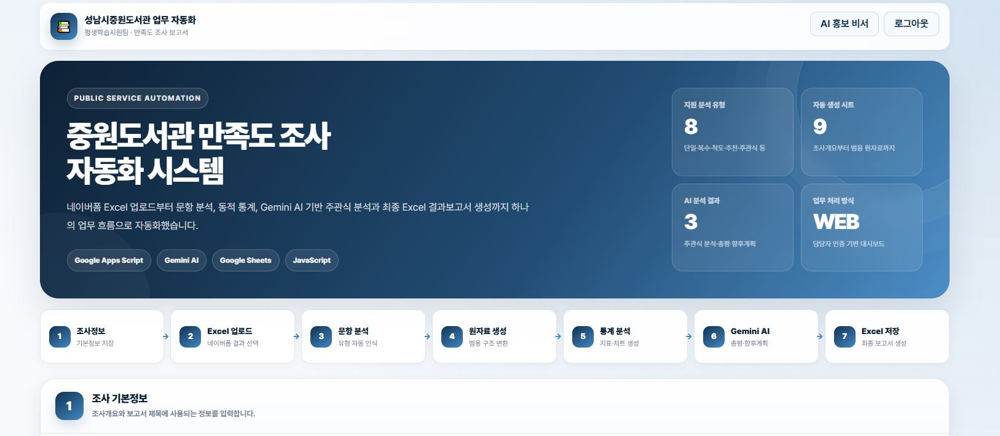
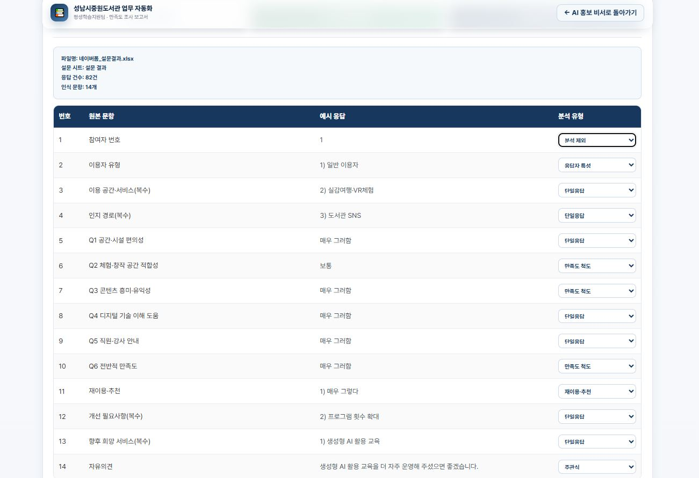
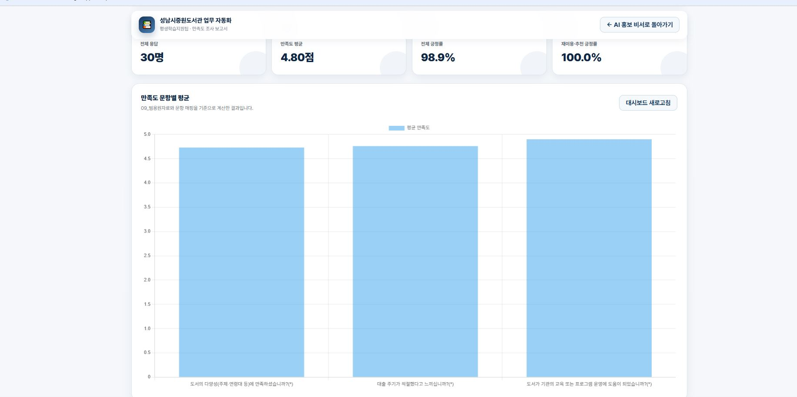
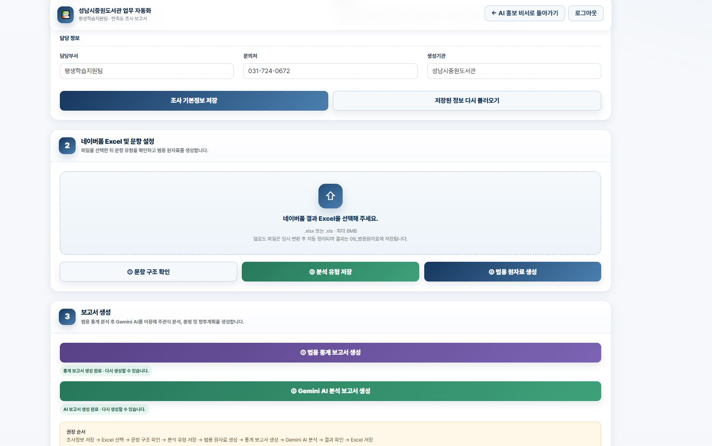
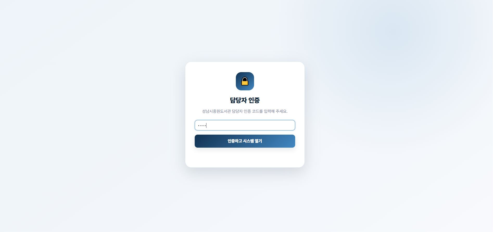

# 📊 중원도서관 만족도 조사 자동화 시스템


> **Google Apps Script와 Gemini AI를 활용한 범용 만족도 조사 분석 및 결과보고서 자동 생성 시스템**

공공도서관에서 실시하는 만족도 조사 업무를 효율적으로 지원하기 위해 개발한 웹 기반 업무 자동화 시스템입니다.

네이버폼 Excel 결과 파일을 업로드하면 문항 구조를 자동 분석하고, 통계 분석부터 AI 주관식 분석, 최종 Excel 결과보고서 생성까지 하나의 업무 흐름으로 자동 수행합니다.

---

# 🚀 프로젝트 소개

| 항목 | 내용 |
|------|------|
| 프로젝트명 | 중원도서관 만족도 조사 자동화 시스템 |
| 개발 기간 | 2026.07 ~ 2026.08 |
| 개발자 | 임성래 |
| 프로젝트 유형 | 공공기관 업무 자동화 |

---

# 🛠 기술 스택

| 구분 | 기술 |
|------|------|
| Backend | Google Apps Script |
| Frontend | HTML5 / CSS3 / JavaScript |
| AI | Gemini API |
| Data | Google Spreadsheet |
| Excel | SheetJS |

---

# 📌 프로젝트 배경

도서관 프로그램 종료 후 만족도 조사를 실시하면 담당자는 반복적으로 다음과 같은 업무를 수행해야 합니다.

- Excel 원자료 정리
- 문항별 통계 계산
- 차트 생성
- 주관식 의견 분석
- 결과보고서 작성

또한 프로그램마다 문항 수와 응답 방식이 달라 기존 양식을 그대로 활용하기 어려운 문제가 있었습니다.

본 프로젝트는 이러한 반복 업무를 자동화하여 담당자가 데이터 검토와 결과 활용에 집중할 수 있도록 개발되었습니다.

---

# 🎯 해결하고자 한 문제

### 기존 업무

- 설문 결과 수작업 정리
- 문항 유형 직접 분류
- 통계 계산
- 차트 작성
- 주관식 의견 직접 분석
- 결과보고서 작성

↓

### 개선

- 문항 자동 분석
- 통계 자동 생성
- AI 의견 분석
- Excel 결과보고서 자동 생성

---

# 🖥 실행 화면

## 메인 화면

사용자가 순서대로 업무를 진행할 수 있도록 Workflow 기반 UI를 제공합니다.



---

## 문항 자동 분석

Excel 문항과 예시 응답을 분석하여 문항 유형을 자동 추천합니다.

담당자는 필요 시 유형을 직접 수정할 수 있습니다.



---

## 결과 대시보드

응답자 수, 평균 만족도, 긍정률 등을 시각적으로 제공합니다.



---

## 업무 처리 화면

조사 기본정보 입력부터 AI 분석 및 Excel 생성까지 하나의 업무 흐름으로 제공합니다.



---

## 로그인

담당자 인증 후 시스템을 사용할 수 있습니다.



---

# ✨ 주요 기능

## 📄 조사 기본정보 관리

- 조사명
- 조사기간
- 담당부서
- 문의처
- 생성기관

입력한 정보는 결과보고서에 자동 반영됩니다.

---

## 📂 Excel 업로드

네이버폼에서 다운로드한 Excel 결과 파일을 업로드하여 분석을 시작합니다.

---

## 🧠 문항 자동 분석

업로드한 Excel 문항을 분석하여 다음 유형을 지원합니다.

- 응답자 특성
- 개인정보
- 단일응답
- 복수응답
- 만족도 척도
- 재이용·추천
- 주관식
- 분석 제외

필요 시 담당자가 직접 수정 가능합니다.

---

## 📊 범용 원자료 생성

문항 구조를 기반으로 다양한 설문에서 사용할 수 있는 범용 원자료를 자동 생성합니다.

---

## 📈 통계 분석

자동 생성

- 응답자 특성
- 빈도 분석
- 비율 계산
- 평균 만족도
- 긍정률
- 차트 생성

---

## 🤖 Gemini AI 분석

주관식 의견을 기반으로

- 의견 분류
- AI 총평
- 향후 개선 방향

초안을 자동 생성합니다.

> AI 분석 결과는 담당자가 검토 후 활용하도록 설계하였습니다.

---

## 📑 Excel 결과보고서 생성

자동 생성 시트

- 조사개요
- 대시보드
- 응답자 특성
- 단일응답 분석
- 복수응답 분석
- 만족도 분석
- AI 분석
- 향후 계획
- 범용 원자료

---

# 🔄 업무 흐름

```text
조사 기본정보 입력
        │
        ▼
Excel 업로드
        │
        ▼
문항 자동 분석
        │
        ▼
분석 유형 설정
        │
        ▼
범용 원자료 생성
        │
        ▼
통계 분석
        │
        ▼
Gemini AI 분석
        │
        ▼
Excel 결과보고서 생성
```

---

# 🏗 시스템 구성도

```text
사용자

      │

      ▼

Web Dashboard

      │

      ▼

Google Apps Script

      │

 ┌──────────────┬──────────────┬──────────────┐
 │              │              │
 ▼              ▼              ▼

Spreadsheet   Gemini API     SheetJS

      │

      ▼

Excel 결과보고서
```

---

# 📂 프로젝트 구조

```text
Library-Survey-Automation-System

├── AppsScript
│   ├── Code.gs
│   ├── Authentication.gs
│   ├── SurveyAnalysis.gs
│   ├── GeminiAnalysis.gs
│   ├── ReportGenerator.gs
│   └── ...

├── Web
│   ├── index.html
│   └── survey-dashboard.html

├── images
│   ├── main.JPG
│   ├── mapping.JPG
│   ├── dashboard.JPG
│   ├── workflow.JPG
│   └── login.JPG

└── README.md
```

---

# 🎯 프로젝트 성과

- Google Apps Script 기반 웹 업무 자동화 시스템 구현
- 다양한 설문 양식을 지원하는 범용 문항 분석 기능 구현
- Gemini AI 기반 주관식 의견 분석 기능 구현
- 통계 분석부터 Excel 결과보고서 생성까지 하나의 업무 흐름으로 자동화
- 실제 공공도서관 업무를 대상으로 개발 및 테스트

---

# 🚀 향후 개선 계획

- 6점 척도 자동 인식
- PDF 결과보고서 생성
- 결과 대시보드 고도화
- 작업 이력 관리
- UI/UX 개선
- 통계 시각화 기능 확대

---

# 👨‍💻 Developer

**임성래**

성남도시개발공사 중원도서관 청년 체험형 인턴

Google Apps Script · JavaScript · Gemini AI 기반 업무 자동화 프로젝트

---

## ⭐ 프로젝트 한 줄 소개

> **"반복되는 만족도 조사 업무를 AI와 Google Apps Script를 활용하여 하나의 웹 시스템으로 자동화한 프로젝트"**

---

# 운영 및 배포 가이드

## 필수 Script Properties

| 이름 | 용도 |
|---|---|
| `GEMINI_API_KEY` | Gemini API 호출 키 |
| `GEMINI_MODEL` | 선택 사항. 미설정 시 코드 기본 모델 사용 |
| `WEB_APP_PASSCODE` | 만족도 대시보드 접근 코드 |

## Apps Script 설정

1. 이 저장소의 `AppsScript` 파일을 하나의 Apps Script 프로젝트에 배치합니다.
2. **서비스 > Google Drive API(Advanced Drive Service)** 를 활성화합니다.
3. 연결된 Google Cloud 프로젝트에서도 Google Drive API를 활성화합니다.
4. Script Properties를 등록하고, 대상 Spreadsheet에 바인딩합니다.
5. 웹 앱은 실행 사용자를 소유자로 설정하고 기관 정책에 맞는 접근 범위로 배포합니다.
6. 배포 전 실제 테스트 Spreadsheet에서 Excel 변환, Gemini, 차트, XLSX 내보내기를 각각 확인합니다.

저장소에는 실제 배포 ID, Cloud Project ID 및 기관별 OAuth 범위를 임의로 기록하지 않습니다.

## 테스트 구분

- 순수 로직: `testSurveyAIQuestionMappingStage1()`, `testDynamicSurveyPureCalculations()`
- Apps Script 통합: `testDynamicSurveySource()`, `testDynamicSurveyAnalysis()`, `testDynamicAIReportGeneration()`
- 통합 테스트는 운영 Spreadsheet가 아닌 복제된 테스트 Spreadsheet에서 실행합니다.

## 롤백

1. 배포 전 Apps Script 버전을 새로 생성합니다.
2. 문제가 발생하면 웹 앱 배포의 버전을 직전 버전으로 되돌립니다.
3. Git에서는 대상 커밋을 `git revert <commit>`로 되돌리고 강제 푸시는 피합니다.
4. 보고서 재생성 전 원본 Excel과 기존 Spreadsheet 사본을 보존합니다.

## 알려진 플랫폼 확인사항

Google Sheets 차트가 XLSX 변환 후 Excel에서 동일하게 유지되는지는 차트 종류와 변환기 동작에 따라 달라질 수 있으므로 실제 배포 환경에서 확인해야 합니다. CacheService는 세션 보조 수단이며 영구 저장소로 사용하지 않습니다.
